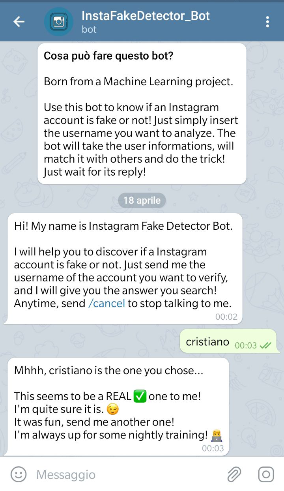
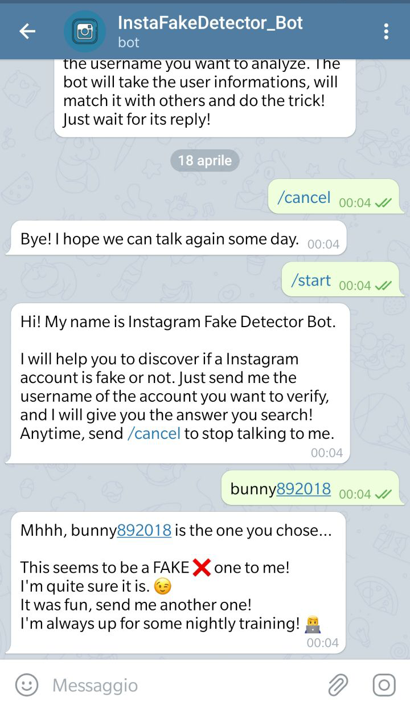

# InstaFakeDetector_Bot
<!-- PROJECT LOGO -->
  
  
  

  [](https://github.com/danielepelleg/InstaFakeDetector_Bot/blob/master/LICENSE)
  
  <br />
    <p align="center">
  <a href="https://github.com/danielepelleg/InstaFakeDetector_Bot">
    
  </a>
  <h1 align="center">Insta Fake Detector Bot</h1>
  <p align="center">
    Telegram Bot written in Python to recognize whether a Instagram account is fake or not.
  </p>
  <p align="center">
    Use of AdaBoost Classification Machine Learning Algorithm
  </p>
  
  <!-- TABLE OF CONTENTS -->
  ## 📚 Table of Contents
  
  - [Table of Contents](#table-of-contents)
  - [About The Project](#about-the-project)
  - [Getting Started](#getting-started)
    - [Token](#token)
    - [Installation](#installation) 
    - [Updates](#updates)
  - [Screenshots](#screenshots)
  - [License](#license)
  - [Contributors](#contributors)
   
   <!-- ABOUT THE PROJECT -->
   ## 🤖 About The Project
   **InstaFakeDetector Bot** is a Telegram userbot running on Python 3, which can be used to know if a Instagram's username 
   belongs to a fake account or not. This bot is part of a Machine Learning project. It use the AdaBoost Classification Algorithm
   to decide the authenticity of an account. 

   Once started, the bot simply ask the user to send it a username of an Instagram account to verify. If the user insert an existing username, the bot checks its privacy and scrape the relative account informations corrisponding to the username. Depending on the privacy of the account it then decide which dataset use for training the algorithm with.

   Eventually, it sends the reply with the prediction to the user, and ask him to send another username to verify.

   Check 👉 [_Instagram Fake Account Detection_] 👈 to see the corresponding machine learning main project. Understand
   what the bot is part of and how the account's detection works.
   
   <!-- GETTING STARTED -->
   ## 🔨 Getting Started
   
   ### Token
   Insert your token in a new _token.txt_ file in the _resources/_ folder to to let it run on your telegram bot.

   ### Installation
   You can just clone this repository and install the requirements by running:
   ```
   $ pip install python-telegram-bot --upgrade
   ```
   ```
   $ pip install igramscraper
   ```
   Then start the _instafakedetector_bot.py_ file in _src/_ folder to run the bot on Telegram. 
   
   ### Updates
   Pull this repository for updates.
   
   <!-- LICENSE -->
   ## 🔑 LICENSE
   Distributed under the GPL License. See `LICENSE` for more information.
   
   Icons made by <a href="https://www.flaticon.com/authors/roundicons" title="Roundicons">Roundicons</a> from <a href="https://www.flaticon.com/" title="Flaticon"> www.flaticon.com</a>
   
   <!-- SCREENSHOTS -->
   ## 📱 SCREENSHOTS
   Bot Info             |  Real Account             |  Fake Account
   :-------------------------:|:-------------------------:|:-------------------------:
     |    |  
   
   <!-- CONTRIBUTORS -->
   ## CONTRIBUTORS
   [Daniele Pellegrini](https://github.com/danielepelleg) - 285240
   
   [Riccardo Fava](https://github.com/BeleRicks11) - 287516

   <!------ ------->
   [_Instagram Fake Account Detection_]: https://github.com/BeleRicks11/Instagram_Fake_Account_Detectio